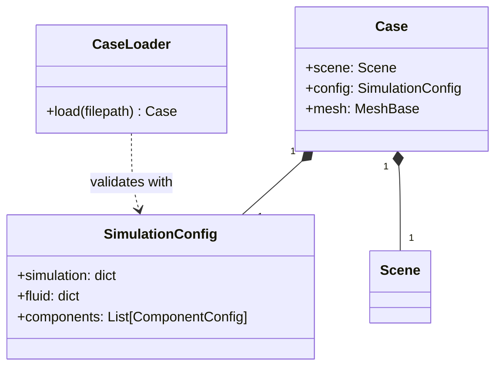
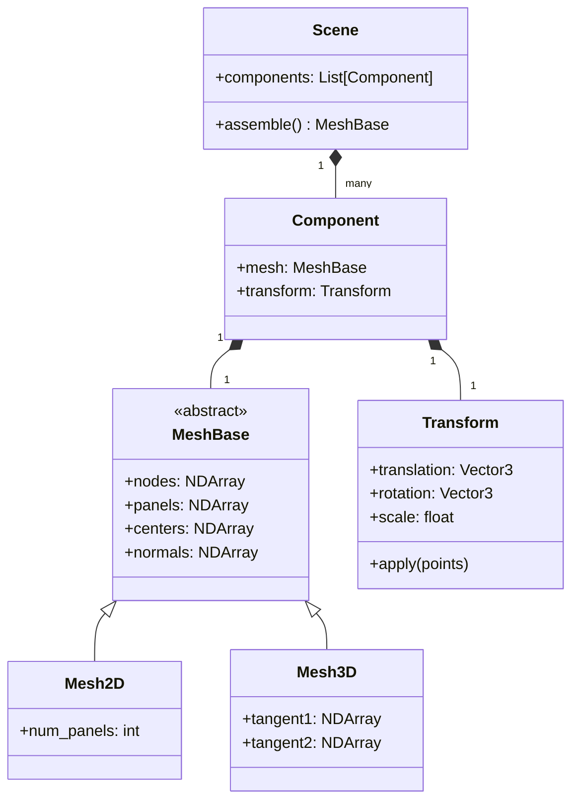
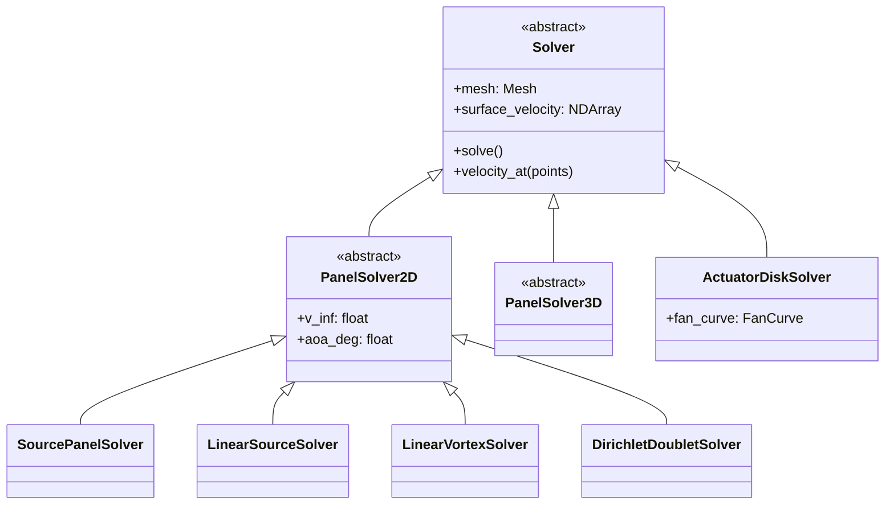
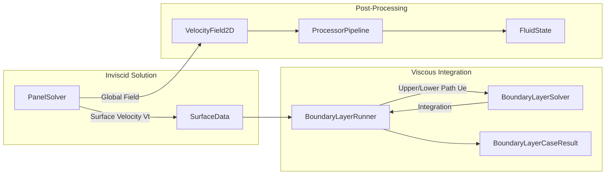
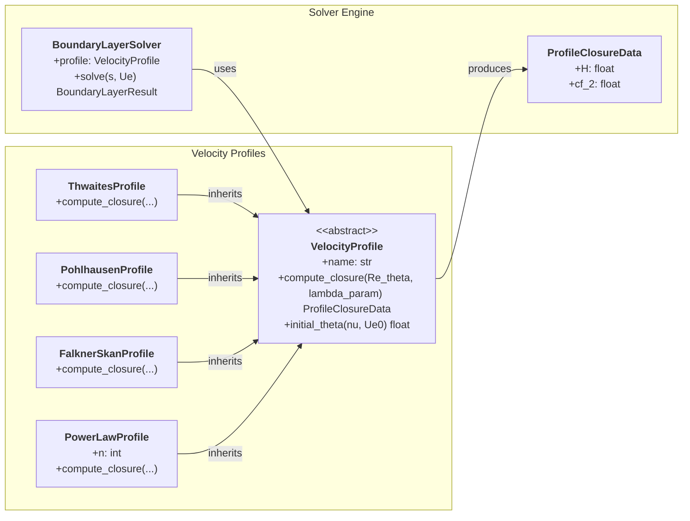
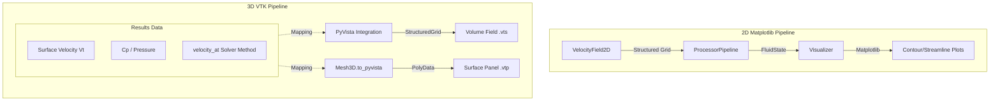
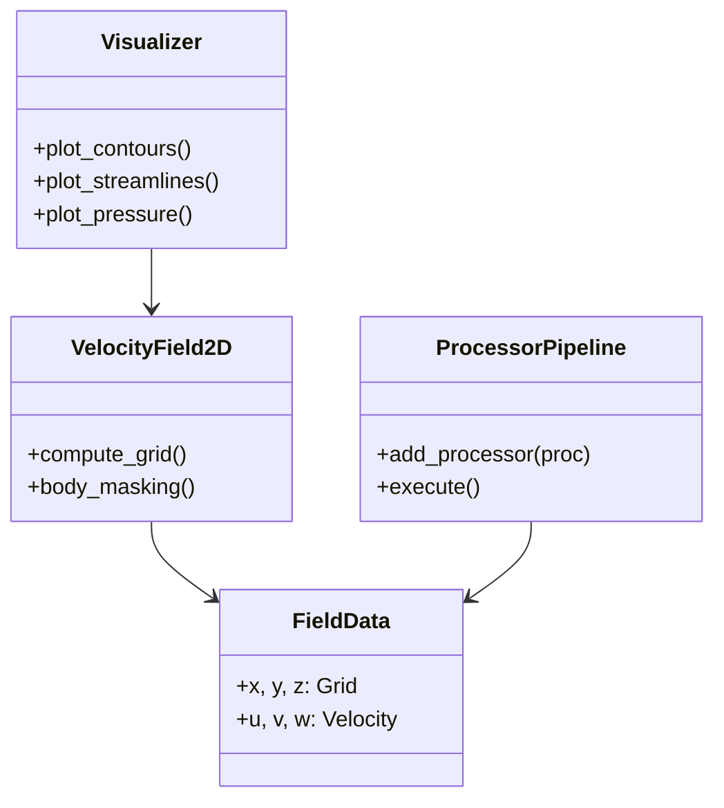
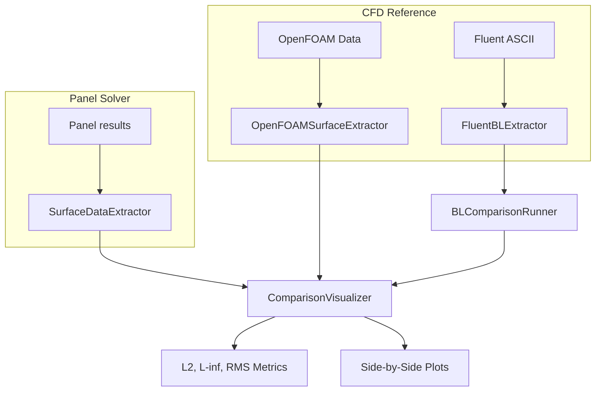

# Class Structure and Module Interaction

This document details the software architecture, class hierarchies, and data flow between the main modules of the framework, including the solvers, visualization pipeline, and validation adapters.

## 0. Pre-processing and Geometry Classes

The pre-processing module manages the lifecycle of a simulation from disk to the memory-resident mesh.

### 0.1. Case and Configuration
The framework uses a configuration-driven approach where data structures are validated at the IO boundary.

### 0.2. Geometry and Scene Graph
A hierarchical scene graph allows for complex assemblies of parts with individual spatial transforms.

*   **`MeshBase` (ABC)**: Provides the fundamental geometry storage. It handles the computation of geometric properties like panel centers, lengths/areas, and outward-facing normals.
*   **`Scene`**: Acts as the root container. The `assemble()` method iterates through components, applies their `Transform` to the local nodes, and concatenates them into a single global mesh.
*   **`Transform`**: Encapsulates 3D rigid body motion (translation and Euler rotations) using vectorized NumPy operations.

## 1. Solver Class Hierarchy

The solver architecture is designed for multi-fidelity analysis, supporting both 2D and 3D potential flow, as well as separate boundary layer physics.

### 1.1. Base Solver Interface
All solvers implement a unified interface defined by the `Solver` abstract base class (ABC), ensuring they can be used interchangeably by visualization and post-processing tools.

*   **`Solver` (ABC)**: Defines the contract for all flow solvers. Requires implementation of `solve()` and `velocity_at()`. Output velocity is always an `(N, 3)` array.
*   **`PanelSolver2D`**: Focuses on 2D potential flow. Manages freestream vectors and AoA.
*   **`SourcePanelSolver` (SPM)**: Implements constant-strength source panels (Katz & Plotkin).
*   **`LinearSourceSolver`**: Higher-order implementation for improved accuracy in tangential velocity gradients.

## 2. Solver Interaction & Data Flow

The following diagram illustrates how data from the inviscid Panel Solver is passed to the Boundary Layer Solver and the post-processing pipeline.

### 2.1. Panel to Boundary Layer Connection
The `BoundaryLayerRunner` acts as the bridge between the potential flow solution and the viscous boundary layer integration.

1.  **Data Extraction**: Once `PanelSolver.solve()` completes, the tangential velocity $V_t$ is extracted for each panel.
2.  **Path Identification**: `BoundaryLayerRunner` identifies stagnation points and splits the closed body surface into "upper" and "lower" surface streamlines (paths).
3.  **Marching**: The `BoundaryLayerSolver` integrates the Von Kármán momentum integral equation forward along these paths, using the edge velocity $U_e(s) \approx |V_t(s)|$.
4.  **Closure**: Subclasses of `VelocityProfile` (e.g., `ThwaitesProfile`, `PohlhausenProfile`) provide the necessary closure relations.

### 2.2. Boundary Layer Solver and Profile Closure
The `BoundaryLayerSolver` relies on the Strategy Pattern to incorporate different velocity profile families. The `VelocityProfile` abstract class defines the "Closure" interface required to solve the momentum integral ODE.

*   **`VelocityProfile` (ABC)**: Acts as the closure provider. It maps local Reynolds number ($Re_\theta$) and pressure gradient parameters ($\lambda$) to integral parameters like the shape factor $H$ and skin friction coefficient $C_f$.
*   **Encapsulated Physics**: The `BoundaryLayerSolver` contains the general integration logic (Runge-Kutta marching), while the specific fluid physics (laminar vs. turbulent, pressure gradient sensitivity) are encapsulated within the specific `VelocityProfile` subclasses.
*   **`ProfileClosureData`**: A simple data container that returns the results of a profile evaluation back to the numerical integrator at each step.

## 3. Visualization Pipeline

The framework supports a dual visualization pipeline: a fast 2D Matplotlib-based path for rapid iterations and a high-fidelity 3D VTK-based path for full volumetric analysis.

### 3.1. 2D Pipeline (Matplotlib)
The visualization module uses a facade pattern to provide high-level plotting capabilities while delegating complex fieldwork to dedicated processors.

*   **`VelocityField2D`**: Generates a structured grid over the domain and evaluates the solver's `velocity_at()` method at each point. It performs **body masking** to ensure velocity is zero or NaN inside solid components.
*   **`ProcessorPipeline`**: Executes a topological sequence of processors (e.g., `PressureProcessor`, `VorticityProcessor`) to enrich the `FieldData` with derived quantities.

### 3.2. 3D Pipeline (PyVista / ParaView)
For complex geometries and 3D solvers, the framework exports data to VTK formats for inspection in ParaView.

*   **`Mesh3D.to_pyvista()`**: Converts the internal 3D mesh representation (nodes/panels) into a `pyvista.PolyData` object. Surface quantities like $C_p$ and $V_t$ are stored as `cell_data`.
*   **`export_solution_vtk()`**: A utility that writes both the surface mesh and volumetric data to `.vtp` (PolyData) and `.vts` (StructuredGrid) files.
*   **Volumetric Sampling**: Unlike the 2D pipeline which uses a custom `VelocityField2D` class, 3D sampling often leverages PyVista's `StructuredGrid` and `select_enclosed_points` for interior masking, providing a standardized high-performance way to visualize flow fields.

## 4. Validation & Comparison

The validation framework compares the solver results against high-fidelity CFD data from OpenFOAM and ANSYS Fluent.

### 4.1. Comparison Architecture
The system uses "Adapters" to normalize external CFD data into a format that can be compared station-by-station with the panel solver.

### 4.2. Comparison Methods
*   **OpenFOAM Comparison**: Uses `OpenFOAMSurfaceExtractor` to read surface fields (p, U) from OpenFOAM polyMesh/time directories. It maps CFD cell-face values to the nearest panel control points.
*   **Fluent Comparison**: Specifically designed for Boundary Layer validation. `FluentBLExtractor` reads exported ASCII profiles. The `BLFieldInterpolator` then regrids the Fluent data onto the same $s-\eta$ (arc-length vs normal distance) coordinate system used by the BL solver to allow direct error subtraction.
*   **Metrics**: In both cases, the `ComparisonVisualizer` computes:
    *   **$L_2$ Norm**: Overall energy of the error.
    *   **$L_\infty$ Norm**: Maximum local discrepancy.
    *   **RMS/MAE**: Standard statistical errors.
    *   **Relative Error**: Normalized against the free-stream or peak values.
