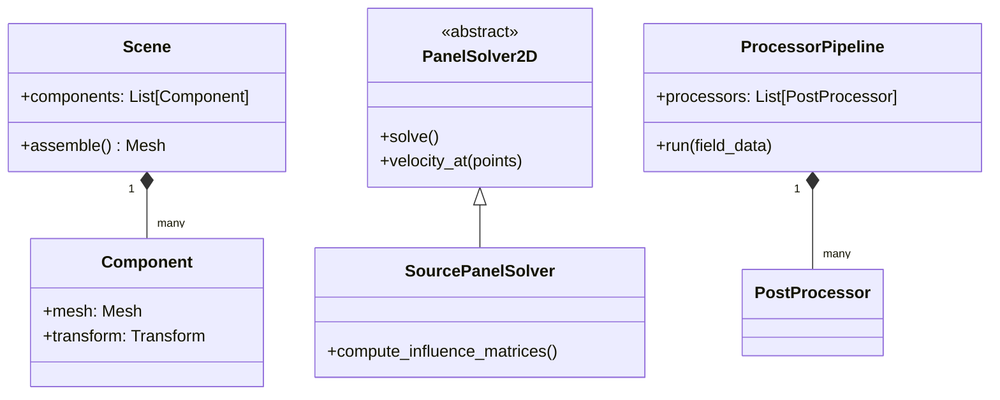
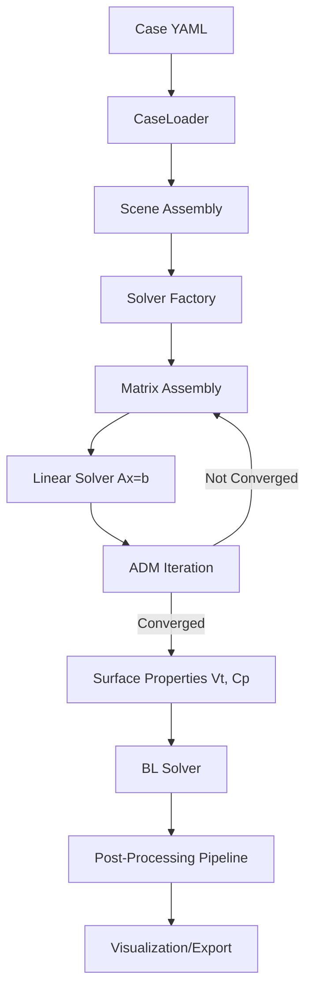

# Implementation Details: Desktop PC Thermal and Acoustic Framework

This document provides a comprehensive overview of the methodology, algorithms, and coding approaches used in the development of the fluid and thermal solvers, specifically designed for desktop PC analysis.

## 1. Methodology and Algorithms

### 1.1. Pre-processing Hierarchy (Geometry & Case Handling)
The pre-processing stage is responsible for converting high-level case definitions into a unified mathematical mesh ready for the solver.

#### A. Case Loading and Validation
*   **CaseLoader**: Handles the parsing of `case.yaml` files. It uses **Pydantic** (`SimulationConfig`) to perform strict schema validation, ensuring all physical properties (fluid density, velocity) and component definitions are correctly typed and within valid ranges.
*   **Multi-Level Mesh Control**: Components can define multiple `mesh_levels` (parametric resolutions). The `CaseLoader` allows selecting a specific level at runtime to facilitate convergence studies and multi-fidelity analysis.

#### B. Geometry Generation and Mesh Synthesis
The framework supports two main paths for geometry generation:
*   **Parametric Generation (2D)**: Built-in primitives for circles, rectangles, and rounded rectangles. These generators produce CCW-ordered line segments ensuring consistent normal vectors ($n$ pointing outward).
*   **High-Fidelity 3D Generation**: For 3D analysis, the framework integrates with **Gmsh** through a specialized `gmsh_reader`.
    *   **STEP/STL Support**: Users can provide `.step` or `.stl` files.
    *   **Quad-Dominant Meshing**: The reader invokes Gmsh's Blossom algorithm to generate structured-like quadrilateral meshes, which are required for the 3D potential flow algorithms implemented in `Mesh3D`.
    *   **Scaling and Centering**: Post-import transforms handle unit conversions (e.g., mm to m) and coordinate alignment.

#### C. Scene Assembly
*   **Scene Graph**: A `Scene` object contains multiple `Component` instances. Each component wraps a local mesh and a `Transform` (defining translation, rotation, and scale).
*   **Unified Assembly**: During `Scene.assemble()`, local meshes are synthesized into a single global mesh. The system maintains a `component_id` map, allowing the solver to distinguish between different bodies (e.g., a CPU heatsink vs. a GPU casing) for localized post-processing.

### 1.2. Fluid Solver (Aerodynamics)
The fluid solver is a multi-fidelity hybrid system that combines potential flow theory with boundary layer integral methods to achieve rapid evaluation without the computational cost of full Navier-Stokes CFD.

#### A. Inviscid Solver: Source Panel Method (SPM)
*   **Algorithm**: Based on the **Katz & Plotkin** formulation for 2D constant-strength source panels.
*   **Mathematical Basis**: The solver solves the Laplace equation for velocity potential ($\nabla^2 \phi = 0$). The surface of the body is discretized into linear segments (panels) with a constant source distribution ($\sigma$).
*   **Boundary Conditions**: Implements the **Neumann Boundary Condition** (no-penetration), where the normal component of velocity at each panel control point is zero ($V \cdot n = 0$).
*   **Linear System**: Assembles a global influence matrix $A$ where $A_{ij}$ represents the normal velocity induced by panel $j$ on panel $i$. The system $A\sigma = b$ (where $b$ is the freestream contribution) is solved to find the singularity strengths.
*   **Velocity Recovery**: Once $\sigma$ is known, the tangential velocity ($V_t$) and pressure coefficient ($C_p$) are calculated using the principle of superposition.

#### B. Actuator Disk Model (ADM) for Fans
*   **Algorithm**: Fans are modeled as zero-thickness disks that impart a pressure jump ($\Delta p$) to the flow.
*   **Coupling**: The pressure jump is coupled with the fan's manufacturer-provided performance curve (P-Q curve). The operating point is found iteratively by matching the flow rate ($Q$) through the disk with the pressure rise required by the system.
*   **Implementation**: Modeled using doublet distributions or explicit velocity jumps in the potential flow field.

#### C. Viscous Solver: Boundary Layer Integral Methods
*   **Algorithm**: Instead of solving the full boundary layer equations, the solver uses integral quantities (displacement thickness $\delta^*$, momentum thickness $\theta$).
*   **Methodology**:
    *   **Thwaites' Method**: Used for laminar boundary layers to compute $\theta$ and $\delta^*$ along the surface arc-length $s$.
    *   **Pohlhausen/Falkner-Skan**: Provides velocity profile shapes based on the local pressure gradient.
    *   **Transition Prediction**: Implements **Michel’s criterion** or the **$e^N$ method** to predict the move from laminar to turbulent flow.
    *   **Power-Law Profiles**: Used for modeling the turbulent boundary layer regime.

---

## 2. Coding Approaches

### 2.1. Object-Oriented Architecture
The codebase follows a modular object-oriented design to ensure extensibility:

*   **`Scene` and `Component`**: Manages the hierarchy of parts (e.g., case, CPU cooler, GPU). Components handle their own transformations (translation/rotation) and mesh generation.
*   **`Solver` Hierarchy**: Uses an Abstract Base Class (`PanelSolver2D`) to define the interface for different solver types (Source, Vortex, Doublet), allowing them to be swapped easily via a **Factory Pattern**.
*   **`ProcessorPipeline`**: Post-processing steps (pressure, streamlines, vorticity) are organized as discrete "processors" that can be chained together.

### 2.2. High-Performance Numerical Computing
*   **Vectorization**: Heavy use of **NumPy** for vectorized operations on panel arrays. This avoids slow Python loops, especially in the computation of influence matrices (which has $O(N^2)$ complexity).
*   **Numba JIT**: Critical numerical kernels (such as the influence integral calculations) are decorated with `@njit` to compile them to machine code at runtime, providing performance comparable to C/C++.
*   **Memory Efficiency**: Arrays are consistently maintained in `(N, 3)` format to allow for future 3D extension while maintaining memory alignment for fast access.

---

## 3. Libraries vs. Original Development

### 3.1. Original Development (Core Logic)
*   **Panel Influence Kernels**: The specialized integration logic for various panel types (constant source, linear source) was developed specifically for this project following theoretical literature.
*   **ADM Coupling Logic**: The iterative algorithm to find the fan operating point on a P-Q curve.
*   **Integral BL Solver**: The implementation of Thwaites' and Pohlhausen's methods for surface streamline marching.
*   **Validation Pipeline**: The `validation/` module which includes adapters to automatically interpolate and compare results against **OpenFOAM** and **ANSYS Fluent** data.
*   **Geometry Generators**: Custom algorithms to generate parametric PC components (e.g., rounded rectangles, heatsink fin arrays).

### 3.2. Third-Party Libraries (Foundational Tools)
*   **NumPy / SciPy**: Used for linear algebra ($Ax=b$ solvers), array manipulation, and interpolation.
*   **Pydantic**: Used for data validation of the YAML case files and configuration schemas.
*   **Matplotlib**: Used for 2D field visualization (contours, streamlines).
*   **PyVista / VTK**: Used for 3D visualization and VTK-based data export.
*   **Gmsh**: Used for high-quality unstructured mesh generation when complex geometries are required.
*   **Shapely**: Used for 2D geometry operations and intersection checks.

---

## 4. Solver Structure: Object/Function Sequence

The following sequence describes the typical flow of the solver execution:

### 4.1. Execution Logic Flow

### 4.2. Detailed Steps
1.  **Initialization (`CaseLoader`)**:
    *   Reads `case.yaml`.
    *   Validates parameters via `Pydantic` schemas.
    *   Instantiates `Component` objects for each geometry.
2.  **Mesh Assembly (`Scene.assemble`)**:
    *   Applies spatial transforms to each component's local mesh.
    *   Merges individual meshes into a global `Mesh` object.
    *   Computes geometric properties (panel centers, normals, lengths).
3.  **Inviscid Solve (`Solver.solve`)**:
    *   Computes the influence matrix $A$ (using Numba-accelerated kernels).
    *   Solves the linear system for panel strengths $\sigma$.
    *   Recovers surface quantities (tangential velocity $V_t$, pressure $C_p$).
4.  **ADM Iteration (if fans are present)**:
    *   Calculates flow through the fan disk.
    *   Updates fan pressure jump based on the fan curve.
    *   Re-solves the potential flow field until convergence.
5.  **Boundary Layer Solve (`BLRunner`)**:
    *   Identifies stagnation points.
    *   Traces surface streamlines.
    *   Integrates BL equations to find $\theta$, $\delta^*$, and $c_f$.
6.  **Post-Processing (`ProcessorPipeline`)**:
    *   Computes the velocity field on a grid using `velocity_at(points)`.
    *   Derives quantities like stream function $\psi$ and vorticity $\omega$.
7.  **Visualization (`Visualizer`)**:
    *   Generates matplotlib plots or PyVista exports for data analysis.
